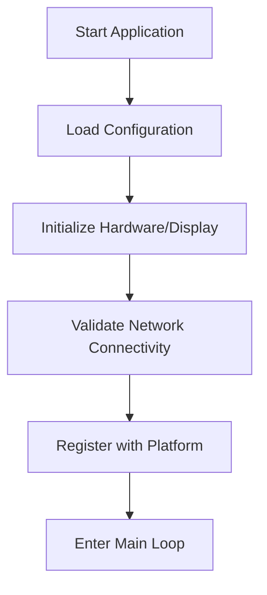
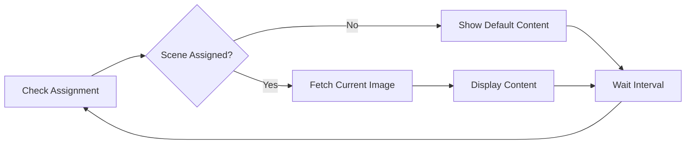

# Display Client Specification v1.0

## Overview

This document provides a platform and programming language agnostic specification for implementing display clients that integrate with the Mimir Platform's multi-display system. Display clients are applications that run on display devices (screens, kiosks, digital signage, etc.) to show content managed by the Mimir Platform.

## Table of Contents

1. [Architecture Overview](#architecture-overview)
2. [Display Client Lifecycle](#display-client-lifecycle)
3. [API Specifications](#api-specifications)
4. [Data Models](#data-models)
5. [Implementation Requirements](#implementation-requirements)
6. [Error Handling](#error-handling)
7. [Security Considerations](#security-considerations)
8. [Performance Guidelines](#performance-guidelines)
9. [Testing & Validation](#testing--validation)
10. [Reference Implementations](#reference-implementations)

## Architecture Overview

### System Components

```
┌─────────────────────┐    ┌─────────────────────┐    ┌─────────────────────┐
│   Web Management    │    │   Mimir Platform    │    │   Display Client    │
│       UI            │◄──►│      API Server     │◄──►│   Application       │
└─────────────────────┘    └─────────────────────┘    └─────────────────────┘
                                      │
                                      ▼
                           ┌─────────────────────┐
                           │     Database        │
                           │  (Displays, Scenes) │
                           └─────────────────────┘
```

### Client Responsibilities

- **Registration**: Register with the platform on startup
- **Status Updates**: Maintain connection and report status
- **Content Fetching**: Poll for and retrieve assigned content
- **Content Display**: Render content according to specifications
- **Error Recovery**: Handle network issues and failures gracefully

## Display Client Lifecycle

### 1. Initialization Phase



### 2. Registration Process

1. **Hardware Detection**: Detect display capabilities
2. **Network Configuration**: Establish connection to platform
3. **Client Registration**: Register with platform API
4. **Capability Advertisement**: Report display specifications
5. **Assignment Check**: Check for existing scene assignments

### 3. Main Operation Loop



### 4. Shutdown Process

1. **Graceful Disconnection**: Notify platform of shutdown
2. **Resource Cleanup**: Free display and network resources
3. **State Persistence**: Save configuration for next startup

## API Specifications

### Base Configuration

- **Protocol**: HTTPS/HTTP
- **Data Format**: JSON
- **Authentication**: Bearer token (future implementation)
- **Rate Limiting**: Respect 120 requests/minute limit

### Required Endpoints

#### 1. Client Registration

**Endpoint**: `POST /api/displays/register`

**Purpose**: Register the display client with the platform

**Request Body**:
```json
{
  "name": "string",              // Human-readable display name
  "description": "string",       // Optional description
  "location": "string",          // Physical location
  "capabilities": {
    "resolution": [1920, 1080],  // Native resolution [width, height]
    "supported_formats": ["jpg", "png", "gif"],  // Supported image formats
    "orientation": "landscape",   // "landscape" | "portrait"
    "refresh_rate_hz": 60        // Display refresh rate
  },
  "tags": ["string"],           // Optional tags for categorization
  "client_version": "1.0.0"     // Client software version
}
```

**Response**:
```json
{
  "id": "uuid",                 // Unique display identifier
  "name": "string",
  "description": "string",
  "location": "string",
  "is_online": false,
  "last_seen": null,
  "assigned_scene_id": null,
  "assigned_scene_name": null,
  "resolution": [1920, 1080],
  "orientation": "landscape",
  "refresh_rate_hz": 60,
  "tags": ["string"],
  "client_version": "1.0.0",
  "current_image_url": null
}
```

#### 2. Status Check

**Endpoint**: `GET /api/displays/{display_id}`

**Purpose**: Get current display status and assignment

**Response**: Same as registration response with updated status

#### 3. Image Fetching

**Endpoint**: `GET /api/displays/{display_id}/current_image`

**Purpose**: Get metadata about the current image to display

**Response**:
```json
{
  "display_id": "uuid",
  "scene_id": "string",
  "scene_name": "string",
  "image_url": "string",        // URL to fetch actual image
  "image_path": "string",       // Server-side path
  "resolution": [1920, 1080],
  "generated_at": "2025-08-20T11:37:41.923305",
  "channels": ["channel1", "channel2"],
  "cache_expires_in": 300       // Seconds until cache expires
}
```

#### 4. Image Download

**Endpoint**: `GET /api/displays/{display_id}/current_image_file`

**Purpose**: Download the actual image file

**Response**: Binary image data (JPEG/PNG)

### Optional Endpoints

#### WebSocket Connection (Advanced)

**Endpoint**: `ws://platform-host/ws/display/{display_id}`

**Purpose**: Real-time notifications for scene changes

**Events**:
- `display_connection_established`
- `scene_assigned`
- `scene_unassigned`
- `image_updated`

## Data Models

### Display Capabilities

```typescript
interface DisplayCapabilities {
  resolution: [number, number];      // [width, height] in pixels
  supported_formats: string[];       // ["jpg", "png", "gif", "webp"]
  orientation: "landscape" | "portrait";
  refresh_rate_hz?: number;          // Optional refresh rate
  color_depth?: number;              // Optional color depth in bits
  brightness_control?: boolean;      // Can control brightness
  touch_enabled?: boolean;           // Touch screen capability
  audio_enabled?: boolean;           // Audio output capability
}
```

### Client Configuration

```typescript
interface ClientConfiguration {
  display_id?: string;              // Set after registration
  platform_url: string;            // Platform API base URL
  poll_interval_seconds: number;   // How often to check for updates
  retry_attempts: number;           // Max retry attempts for failed requests
  retry_delay_seconds: number;     // Delay between retry attempts
  cache_timeout_seconds: number;   // Image cache timeout
  default_content_path?: string;   // Path to default content
  log_level: "debug" | "info" | "warn" | "error";
}
```

### Image Metadata

```typescript
interface ImageMetadata {
  display_id: string;
  scene_id: string;
  scene_name: string;
  image_url: string;
  resolution: [number, number];
  generated_at: string;            // ISO 8601 timestamp
  channels: string[];
  cache_expires_in: number;        // Seconds
  checksum?: string;               // Optional integrity check
}
```

## Implementation Requirements

### Mandatory Features

1. **Registration**: Must register on startup
2. **Status Reporting**: Must update last_seen timestamps
3. **Image Fetching**: Must fetch and display assigned images
4. **Error Recovery**: Must handle network failures gracefully
5. **Resource Management**: Must manage memory and storage efficiently

### Recommended Features

1. **Caching**: Cache images locally to reduce bandwidth
2. **Offline Mode**: Show cached content when disconnected
3. **Logging**: Comprehensive logging for debugging
4. **Configuration**: External configuration file support
5. **Auto-Update**: Ability to update client software remotely

### Optional Features

1. **WebSocket Support**: Real-time updates via WebSocket
2. **Hardware Integration**: Brightness, volume, power controls
3. **Touch Interaction**: Support for interactive displays
4. **Analytics**: Report usage statistics to platform
5. **Playlist Support**: Support for multiple images/videos

## Error Handling

### Network Errors

```python
# Pseudo-code example
def fetch_with_retry(url, max_retries=3):
    for attempt in range(max_retries):
        try:
            response = http_get(url)
            if response.status_code == 200:
                return response
            elif response.status_code == 429:  # Rate limited
                wait_time = parse_retry_after_header(response)
                sleep(wait_time)
            else:
                log_error(f"HTTP {response.status_code}: {response.text}")
        except NetworkError as e:
            if attempt < max_retries - 1:
                sleep(2 ** attempt)  # Exponential backoff
            else:
                raise e
```

### Registration Failures

- **Retry Logic**: Implement exponential backoff
- **Validation Errors**: Check and fix capability data
- **Server Errors**: Log and retry with delay
- **Network Issues**: Fall back to offline mode

### Image Loading Failures

- **Corrupted Images**: Validate image integrity
- **Missing Images**: Fall back to cached or default content
- **Format Errors**: Verify supported format compatibility
- **Size Errors**: Handle resolution mismatches gracefully

## Security Considerations

### Network Security

- **HTTPS**: Always use HTTPS in production
- **Certificate Validation**: Validate SSL certificates
- **Token Management**: Securely store authentication tokens
- **Rate Limiting**: Respect platform rate limits

### Content Security

- **Image Validation**: Validate image format and size
- **Content Filtering**: Scan for malicious content
- **Checksum Verification**: Verify image integrity
- **Sandboxing**: Run content rendering in isolated environment

### Device Security

- **Access Control**: Restrict local file system access
- **Update Security**: Verify software update signatures
- **Configuration Protection**: Secure configuration storage
- **Audit Logging**: Log security-relevant events

## Performance Guidelines

### Bandwidth Optimization

- **Image Caching**: Cache images locally
- **Conditional Requests**: Use If-Modified-Since headers
- **Compression**: Support compressed image formats
- **Delta Updates**: Only fetch changed content

### Memory Management

- **Image Buffers**: Limit concurrent image loading
- **Cache Size**: Implement cache size limits
- **Garbage Collection**: Regular cleanup of unused resources
- **Memory Monitoring**: Monitor and alert on memory usage

### Display Performance

- **Hardware Acceleration**: Use GPU acceleration when available
- **Frame Rate**: Match content refresh to display capabilities
- **Resolution Optimization**: Scale images efficiently
- **Transition Effects**: Smooth transitions between content

## Testing & Validation

### Unit Testing

```python
# Example test cases
def test_registration():
    client = DisplayClient(config)
    response = client.register()
    assert response.status_code == 200
    assert 'id' in response.json()

def test_image_fetching():
    client = DisplayClient(config)
    client.display_id = "test-id"
    metadata = client.fetch_current_image()
    assert metadata.scene_id is not None
    
def test_error_recovery():
    client = DisplayClient(config)
    with mock_network_failure():
        result = client.fetch_with_retry("test-url")
        assert result is not None  # Should recover
```

### Integration Testing

- **Platform Integration**: Test against real platform API
- **Network Conditions**: Test with poor connectivity
- **Hardware Testing**: Test on target display hardware
- **Load Testing**: Test with multiple concurrent clients
- **Failover Testing**: Test graceful degradation

### Validation Checklist

- [ ] Client registers successfully
- [ ] Status updates work correctly
- [ ] Images fetch and display properly
- [ ] Error recovery functions as expected
- [ ] Performance meets requirements
- [ ] Security measures are implemented
- [ ] Logging provides adequate debugging info
- [ ] Configuration is externalized
- [ ] Resource usage is within limits
- [ ] Graceful shutdown works

## Reference Implementations

### Python Example (Simplified)

```python
import requests
import time
import json
from dataclasses import dataclass
from typing import Optional, List, Tuple

@dataclass
class DisplayCapabilities:
    resolution: Tuple[int, int]
    supported_formats: List[str]
    orientation: str = "landscape"
    refresh_rate_hz: int = 60

class DisplayClient:
    def __init__(self, config: dict):
        self.config = config
        self.display_id: Optional[str] = None
        self.platform_url = config['platform_url']
        
    def register(self) -> dict:
        """Register this display client with the platform"""
        capabilities = DisplayCapabilities(
            resolution=self.config['resolution'],
            supported_formats=self.config['supported_formats']
        )
        
        payload = {
            "name": self.config['name'],
            "location": self.config['location'],
            "capabilities": {
                "resolution": list(capabilities.resolution),
                "supported_formats": capabilities.supported_formats,
                "orientation": capabilities.orientation,
                "refresh_rate_hz": capabilities.refresh_rate_hz
            }
        }
        
        response = requests.post(
            f"{self.platform_url}/api/displays/register",
            json=payload
        )
        response.raise_for_status()
        
        result = response.json()
        self.display_id = result['id']
        return result
    
    def fetch_current_image(self) -> Optional[dict]:
        """Fetch current image metadata"""
        if not self.display_id:
            raise ValueError("Client not registered")
            
        response = requests.get(
            f"{self.platform_url}/api/displays/{self.display_id}/current_image"
        )
        
        if response.status_code == 404:
            return None  # No scene assigned
        
        response.raise_for_status()
        return response.json()
    
    def download_image(self, image_url: str) -> bytes:
        """Download image file"""
        response = requests.get(f"{self.platform_url}{image_url}")
        response.raise_for_status()
        return response.content
    
    def main_loop(self):
        """Main operation loop"""
        while True:
            try:
                metadata = self.fetch_current_image()
                if metadata:
                    image_data = self.download_image(metadata['image_url'])
                    self.display_image(image_data)
                else:
                    self.show_default_content()
                    
                time.sleep(self.config['poll_interval'])
                
            except Exception as e:
                print(f"Error in main loop: {e}")
                time.sleep(self.config['error_retry_delay'])
    
    def display_image(self, image_data: bytes):
        """Display the image (platform-specific implementation)"""
        # Implementation depends on display technology
        pass
    
    def show_default_content(self):
        """Show default content when no scene assigned"""
        # Implementation depends on requirements
        pass

# Example usage
config = {
    'platform_url': 'http://localhost:5000',
    'name': 'Conference Room Display',
    'location': 'Building A - Room 203',
    'resolution': [1920, 1080],
    'supported_formats': ['jpg', 'png'],
    'poll_interval': 30,
    'error_retry_delay': 5
}

client = DisplayClient(config)
client.register()
client.main_loop()
```

### JavaScript/Node.js Example (Simplified)

```javascript
const axios = require('axios');
const fs = require('fs');

class DisplayClient {
    constructor(config) {
        this.config = config;
        this.displayId = null;
        this.platformUrl = config.platformUrl;
    }
    
    async register() {
        const payload = {
            name: this.config.name,
            location: this.config.location,
            capabilities: {
                resolution: this.config.resolution,
                supported_formats: this.config.supportedFormats,
                orientation: this.config.orientation || 'landscape',
                refresh_rate_hz: this.config.refreshRate || 60
            }
        };
        
        try {
            const response = await axios.post(
                `${this.platformUrl}/api/displays/register`,
                payload
            );
            
            this.displayId = response.data.id;
            return response.data;
        } catch (error) {
            console.error('Registration failed:', error.message);
            throw error;
        }
    }
    
    async fetchCurrentImage() {
        if (!this.displayId) {
            throw new Error('Client not registered');
        }
        
        try {
            const response = await axios.get(
                `${this.platformUrl}/api/displays/${this.displayId}/current_image`
            );
            return response.data;
        } catch (error) {
            if (error.response?.status === 404) {
                return null; // No scene assigned
            }
            throw error;
        }
    }
    
    async downloadImage(imageUrl) {
        const response = await axios.get(
            `${this.platformUrl}${imageUrl}`,
            { responseType: 'arraybuffer' }
        );
        return Buffer.from(response.data);
    }
    
    async mainLoop() {
        while (true) {
            try {
                const metadata = await this.fetchCurrentImage();
                
                if (metadata) {
                    const imageData = await this.downloadImage(metadata.image_url);
                    await this.displayImage(imageData);
                } else {
                    await this.showDefaultContent();
                }
                
                await this.sleep(this.config.pollInterval * 1000);
                
            } catch (error) {
                console.error('Error in main loop:', error.message);
                await this.sleep(this.config.errorRetryDelay * 1000);
            }
        }
    }
    
    async displayImage(imageData) {
        // Platform-specific implementation
        // Could use Electron, web browser, or native display APIs
    }
    
    async showDefaultContent() {
        // Show default content when no scene assigned
    }
    
    sleep(ms) {
        return new Promise(resolve => setTimeout(resolve, ms));
    }
}

// Example usage
const config = {
    platformUrl: 'http://localhost:5000',
    name: 'Lobby Display',
    location: 'Building A - Main Entrance',
    resolution: [1920, 1080],
    supportedFormats: ['jpg', 'png'],
    pollInterval: 30,
    errorRetryDelay: 5
};

const client = new DisplayClient(config);
client.register().then(() => {
    client.mainLoop();
});
```

## Version History

- **v1.0** (2025-08-20): Initial specification release
  - Basic registration and image fetching
  - Error handling guidelines
  - Reference implementations

## Contributing

This specification is open for feedback and improvements. Please submit issues or pull requests to help enhance the display client ecosystem.

## License

This specification is released under the MIT License. Reference implementations may be used freely in both commercial and non-commercial projects.
