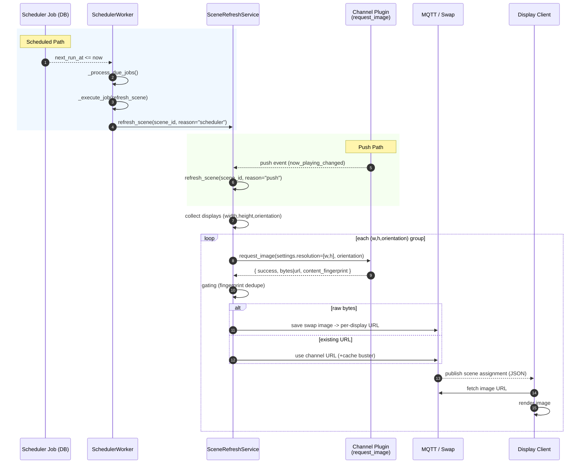
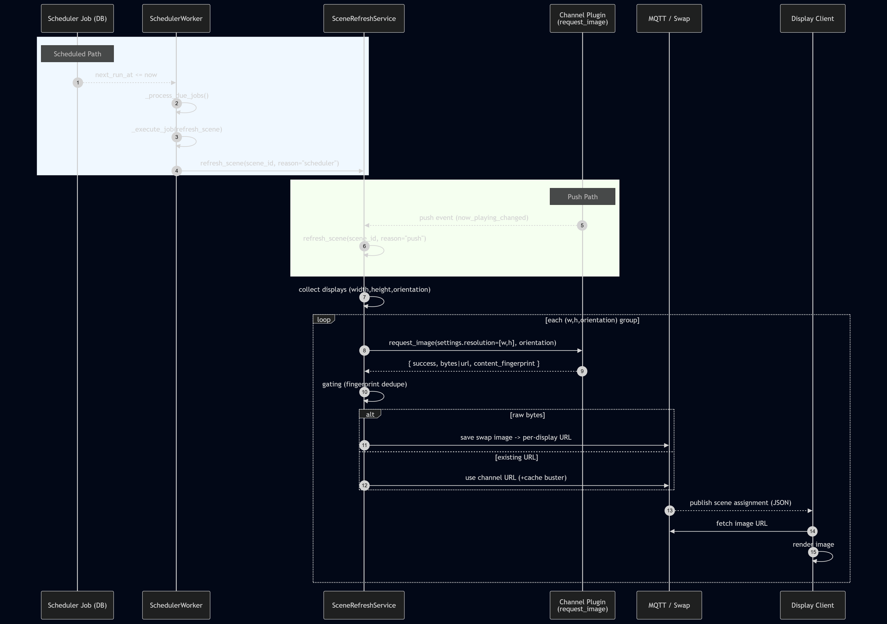

# Image Update Pipeline (Scheduled + Push)

This document describes how an image update propagates from a scheduler job or a channel push event all the way to a display client. It also lists the data payload shapes at each step so you can debug or extend the pipeline confidently.

## Summary
There are two entry paths:
- Scheduled refresh (driven by `SchedulerWorker` polling due jobs)
- Push-triggered refresh (driven by a channel's internal PushManager emitting an event)

Both converge on the same core operation: `SceneRefreshService.refresh_scene()` which gathers displays, requests channel images, and publishes results to displays via MQTT (and/or swap image files).

## Mermaid Sequence Diagram





## Step-by-Step (Scheduled)
1. Scheduler job reaches `next_run_at`.
2. `SchedulerWorker._process_due_jobs` selects due jobs.
3. `SchedulerWorker._execute_job` calls `_refresh_single_scene` per scene assignment.
4. `_refresh_single_scene` awaits `scene_refresh_service.refresh_scene`.
5. `SceneRefreshService` groups displays by resolution + orientation.
6. For each group it calls `channel.request_image(request_data)`.
7. Channel generates image (or reuses cache) and returns metadata + bytes.
8. Service either writes a swap file (bytes) or reuses the returned URL.
9. A cache-busting query param (fingerprint) may be appended.
10. MQTT publish triggers display client fetch & render.

## Step-by-Step (Push)
1. Channel push polling detects content change (e.g. track changed).
2. Channel emits an event (e.g. `now_playing_changed`).
3. Event listener (conceptual; may be thin) triggers `SceneRefreshService.refresh_scene` for affected scenes.
4. Steps 5–10 above are identical to the scheduled path.

## Key Payloads

### A. Channel Image Request (`request_image`)
_Current SceneRefreshService form (no `options` block yet):_
```json
{
  "settings": {
    "resolution": [1920, 1080],
    "orientation": "landscape",
    "distribution": "new",
    "subChannelId": "optional-subchannel-id"
  },
  "gallery_id": "optional-subchannel-id"
}
```

_Legacy / helper style (if using `_request_channel_image`):_
```json
{
  "settings": { "resolution": [1920,1080], "orientation": "landscape", "distribution": "new" },
  "options": { "width": 1920, "height": 1080, "layout": "auto" }
}
```

### B. Channel Response (Success with Bytes)
```json
{
  "success": true,
  "format": "jpeg",
  "width": 1920,
  "height": 1080,
  "description": "Now playing: Track Name by Artist",
  "track_info": { "track_id": "...", "name": "Track Name", "artist": "Artist", "album": "Album" },
  "distribution_mode": "new",
  "content_fingerprint": "trackId|artist|album|name",
  "bytes": "<raw-bytes>",
  "content_type": "image/jpeg",
  "sha256": "af3d...c91"
}
```

### C. Scene Refresh Result (internal aggregation snippet)
```json
{
  "scene_id": "scene-abc",
  "status": "ok",
  "reason": "scheduler",
  "channel_id": "com.spotify.status",
  "displays_updated": 3,
  "image_url": "https://public/channels/swap/scene-abc/display-1.jpg?v=fp",
  "errors": []
}
```

### D. MQTT Publish Payload (conceptual)
```json
{
  "type": "scene_assignment",
  "scene_id": "scene-abc",
  "channel_id": "com.spotify.status",
  "image_url": "https://public/channels/swap/scene-abc/display-1.jpg?v=fp",
  "content_fingerprint": "trackId|artist|album|name",
  "distribution_mode": "new",
  "timestamp": "2025-10-06T12:00:05Z"
}
```

## Fingerprint & Distribution
- `content_fingerprint` identifies semantic content (e.g. track metadata) independent of size.
- `distribution_mode` is usually `new` or `existing`; helps devices decide if redraw is necessary.
- Cache busting param `?v=<fingerprint>` avoids stale caches with stable URLs.

## Common Failure Points
| Stage | Symptom | Likely Cause | Mitigation |
|-------|---------|--------------|------------|
| Channel request | Default size 800x480 | Missing `settings.resolution` & `options` | Ensure request builder populates resolution |
| Refresh skipped | `skipped_reason=unchanged_content` | Fingerprint unchanged | Force refresh (`force=true`) or verify gating logic |
| Displays updated = 0 | No assigned displays | Scene mapping incomplete | Assign displays / verify discovery |
| MQTT no publish | Publisher not connected | Startup race / network | Ensure publisher start before refresh |

## Enhancement Ideas
1. Include `options.width/height` in SceneRefreshService for parity and clarity.
2. Add structured metrics (counter & duration) for each stage (channel latency, publish latency).
3. Introduce a standardized MQTT schema version field.
4. Provide a dry-run flag to test channel requests without distribution.

## Quick Debug Checklist
- Log the outbound `request_image` payload (one line JSON) before sending.
- Confirm returned `content_fingerprint` changes when expected content changes.
- Inspect MQTT payload for correct `image_url` + cache-busting query.
- For size mismatches, compare requested `resolution` vs. channel response `width/height`.

## TL;DR
Both scheduled and push paths funnel through the same refresh pipeline. Provide correct resolution + orientation in the request, rely on fingerprints for dedupe, and watch the cache-busting parameter to ensure displays render the latest image.
